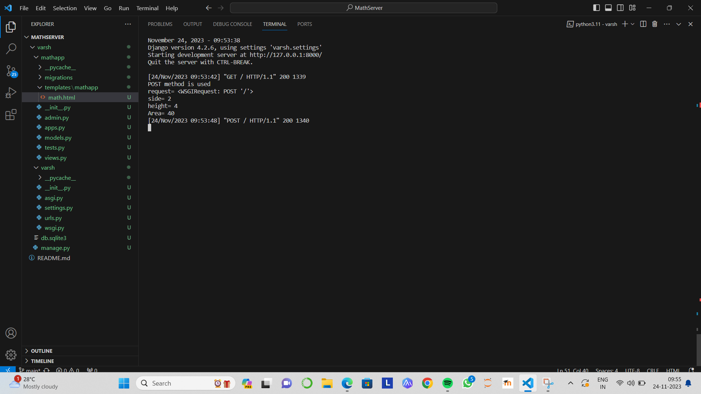
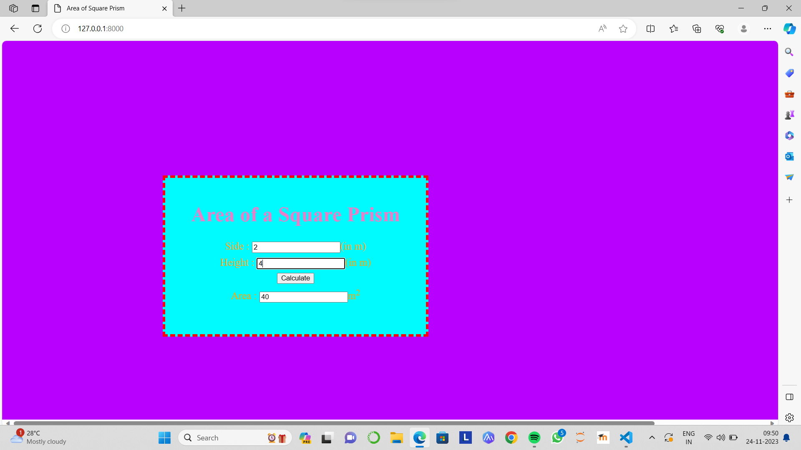

# Ex.05 Design a Website for Server Side Processing
## Date:24.11.2023

## AIM:
To design a website to find total surface area of a square prism in server side.

## FORMULA:
Total Surface Area = 2a<sup>2</sup> + 4ah
<br>b --> Side of Square Prism
<br>h --> Height of Square Prism

## DESIGN STEPS:

### Step 1:
Clone the repository from GitHub.

### Step 2:
Create Django Admin project.

### Step 3:
Create a New App under the Django Admin project.

### Step 4:
Create python programs for views and urls to perform server side processing.

### Step 5:
Create a HTML file to implement form based input and output.

### Step 6:
Publish the website in the given URL.

## PROGRAM :
```
math.html

<html>
<head>
<meta charset='utf-8'>
<meta http-equiv='X-UA-Compatible' content='IE=edge'>
<title>Area of Square Prism</title>
<meta name='viewport' content='width=device-width, initial-scale=1'>
<style type="text/css">
body 
{
background-color:rgb(183, 0, 255);
}
.edge {
width: 1440px;
margin-left: auto;
margin-right: auto;
padding-top: 250px;
padding-left: 300px;
}
.box {
display:block;
border: Thick dashed rgb(255, 0, 13);
width: 500px;
min-height: 300px;
font-size: 20px;
background-color:rgb(0, 251, 255);
}
.formelt{
color:rgb(250, 166, 10);
text-align: center;
margin-top: 7px;
margin-bottom: 6px;
}
h1
{
color:rgb(232, 127, 201);
text-align: center;
padding-top: 20px;
}
</style>
</head>
<body>
<div class="edge">
<div class="box">
<h1>Area of a Square Prism</h1>
<form method="POST">

<div class="formelt">
Side : <input type="text" name="side" value="{{l}}"></input>(in m)<br/>
</div>
<div class="formelt">
Height : <input type="text" name="height" value="{{b}}"></input>(in m)<br/>
</div>
<div class="formelt">
<input type="submit" value="Calculate"></input><br/>
</div>
<div class="formelt">
Area : <input type="text" name="area" value="{{area}}"></input>m<sup>2</sup><br/>
</div>
</form>
</div>
</div>
</body>
</html>

views.py

from django.shortcuts import render
def sqprismarea(request):
    context={}
    context['area'] = "0"
    context['a'] = "0"
    context['h'] = "0"
    if request.method == 'POST':
        print("POST method is used")
        a = request.POST.get('side','0')
        h = request.POST.get('height','0')
        print('request=',request)
        print('side=',a)
        print('height=',h)
        area = 2*int(a)*int(a) + 4*int(a)*int(h)
        context['area'] = area
        context['a'] = a
        context['h'] = h
        print('Area=',area)
    return render(request,'mathapp/math.html',context)

    urls.py

    from django.contrib import admin
from django.urls import path
from mathapp import views
urlpatterns = [
    path('admin/', admin.site.urls),
    path('areaofsqprism/',views.sqprismarea,name="areaofsqprism"),
    path('',views.sqprismarea,name="areaofsqprismroot")
]

```


## SERVER SIDE PROCESSING:


## HOMEPAGE:


## RESULT:
The program for performing server side processing is completed successfully.
